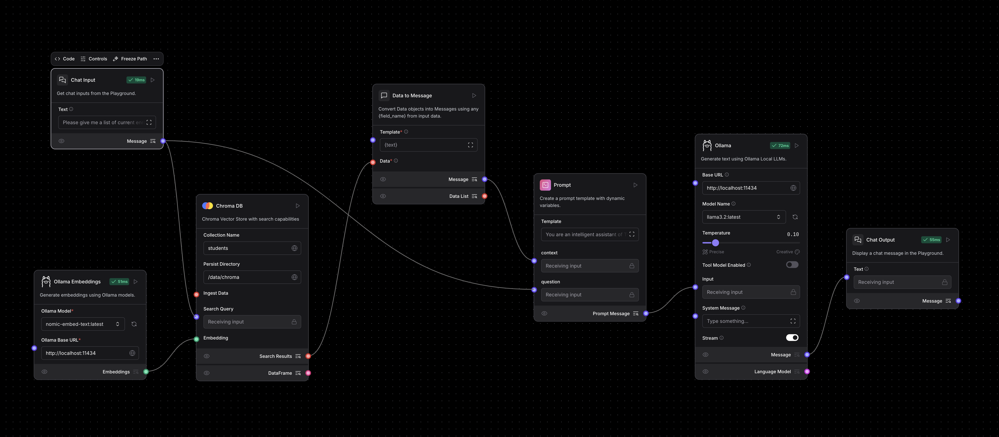

# PowerSchool Langflow
 
## Perquisites

- [Conda](https://docs.tonylabs.com/python/conda)
- [PowerSchool Adapter](https://pypi.org/project/powerschool-adapter/)
- [Ollama](https://ollama.com/)
- [Langflow](https://www.langflow.org/)
- [Chroma](https://www.trychroma.com/)
- Ubuntu Server 22.04 or higher
- GPU is recommended for faster processing (RTX 4090 24GB or A6000 48G is recommended)

## Installation

You can follow the instructions below to install the required components on your local machine or a server. Each component may have different operating system requirements.

1. Follow instructions [here](https://docs.tonylabs.com/ai/ollama) to install Ollama
2. Follow instructions [here](https://docs.tonylabs.com/ai/langflow) to install Langflow
3. Follow instructions [here](https://docs.tonylabs.com/database/chroma) to install Chroma

---

## Getting Started

### Conda Environment

Create a new Conda environment:

```bash
> conda create -n powerschool python=3.12
> conda activate powerschool
```

Install the required packages:

```bash
> pip install -r requirements.txt
```

Now a new virtual environment is ready for this project.

---

### PowerSchool Plugin

Install the `plugin.xml.zip` into your PowerSchool server and get the client ID and secret from the PowerSchool Plugin management. Feel free to extract the `plugin.xml` file and modify it to suit your needs. All the database fields defined in the plugin are read-only.

> ⚠️ Caution: Keep your CLIENT ID and CLIENT SECRET secure. Do not share them with anyone.

---

### Environment

You can download this repository or fork it to your own repository. Create a `.env` file in the root directory of the repository and add the following environment variables:

```dotenv
POWERSCHOOL_SERVER_ADDRESS=https://your_powerschool_domain
POWERSCHOOL_CLIENT_ID=029408f0-e8d1-
POWERSCHOOL_CLIENT_SECRET=f81d4123-3156-
EMBEDDING_API_URL=http://your_ollama_host/api/embeddings
CHROMA_DB_HOST=xxx.xxx.xxx.xxx
CHROMA_DB_PORT=8000
```

Replace the values with your own PowerSchool server address. You can get the client ID and secret from the PowerSchool Plugin management.

> ⚠️ Caution: If your installed plugin for this repository includes database fields with Write permissions, ensure that the target server for this operation is a PowerSchool test instance. This code bears no responsibility for any unintended consequences.

### Run the Application

If you are evaluating the application with a test PowerSchool instance and there is no student data, you can run these two Python file to create dummy student data:

1. Modify the `DUMMY_SCHOOL_NUMBER` to your own school number in the `enroll_dummy_student.py` file. The script will create `10` dummy student records in the PowerSchool database.

```bash
> python enroll_dummy_student.py
```

2. Run `run_this_after_dummy_enroll.py` to validate the data, you should see 10 JSON records in the console.

```bash
> python run_this_after_dummy_enroll.py
```

---

### Text Embeddings

There is a `create_embeddings` class in the `embedding.py` file that generates embeddings for the PowerSchool data. The `create_embeddings` class uses the Ollama API to generate embeddings for the PowerSchool data. It's using the `nomic-embed-text` model to generate embeddings. You can modify the model name to use a different model.

Example:

```text
{'embedding': [-0.6020767092704773, -0.7206705808639526, -2.4430699348449707, -0.6081189513206482, -0.3681376278400421, 0.30644160509109497, 0.8774333596229553, -1.1189463138580322, 1.1225370168685913, -0.03398386389017105, -0.9951059222221375, 0.05440517142415047, 1.6257606744766235, 0.06402243673801422, -0.13153652846813202, -0.5484852194786072, 0.40664592385292053, -0.3808309733867645, ..., -0.6412163972854614]
Payload sent to API: {'model': 'nomic-embed-text', 'prompt': "{'name': 'Hess, Travis', 'grade': '4', 'student_number': 'xxxxx', 'gender': 'Female', 'enroll_status': 'enrolled', 'district_entry_date': '2025-xx-xx', 'entry_date': '2025-xx-xx', 'exit_date': '2025-06-30', 'parents': {'father': 'Timothy Aguirre', 'mother': 'Patty Holmes'}} {'2025': {'tuition': '250885 RMB', 'capital_fee': '13248 RMB'}, '2024': {'tuition': '218220 RMB', 'capital_fee': '20417 RMB'}} [{'type': 'Lego Kit', 'checkout_date': datetime.date(2024, 4, 8)}, {'type': 'Camera', 'checkout_date': datetime.date(2024, 3, 28)}, {'type': 'History Book', 'checkout_date': datetime.date(2024, 9, 8)}, {'type': 'Chinese Book', 'checkout_date': datetime.date(2024, 10, 10)}] {'HepB': {'1st': datetime.date(2007, 12, 16), '2nd': datetime.date(2010, 5, 22), '3rd': datetime.date(2019, 6, 19)}, 'DTaP/Tdap': {'DTaP_series_completed': 'pre-age 7', 'Tdap_booster': datetime.date(2022, 7, 17)}}"}
```

### Run the Application

When you get all the required environment variables and the dummy student data is ready, you can run the application:

```bash
> python vectorize_student_example.py
```

It will read the student data from the PowerSchool database and generate embeddings for each student. The embeddings are stored in the Chroma database.

After the embeddings are generated, you can start build your vector store RAG in Langflow with these components:



---

## Ollama

Install Ollama and choose a LLM model [here](https://ollama.com/library). The `nomic-embed-text` model is required to generate embeddings for the PowerSchool data.

### Recommended LLM:

- llama3.2 1B and 3B
- mistral
- qwen2.5 3B and 7B

---

## Langflow

Drag and drop a Chroma DB component with the following settings:

- Collection Name: students
- Persistence Directory: `/data/chroma`
- Search Query: connect to the `Chat Input` component
- Embedding: connect to an `Ollama Embeddings` component
- Search Results: connect to a`Parse Data` component

---

## Vector Database

Chroma is recommended for storing and searching embeddings because it's full local and doesn't require an internet connection. It's safe and secure for storing sensitive data.

---

## Chatbot

You can install your favourite Web UI chatbot to interact with the Langflow pipeline. The chatbot can be hosted on a server or locally on your machine.
If you don't familiar with Web UI chatbot, you can use the Chat widget from Langflow. It's a simple and easy way to interact with the pipeline.